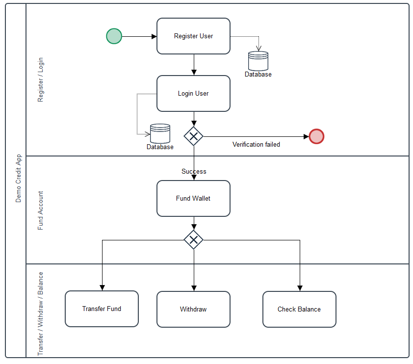
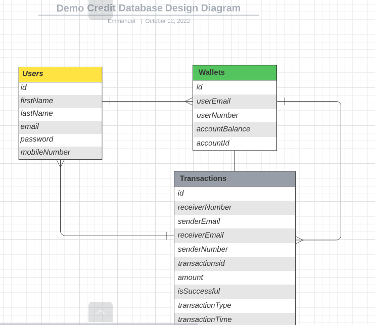
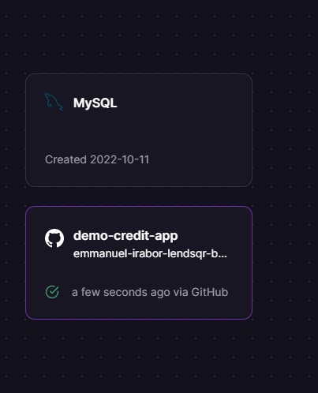
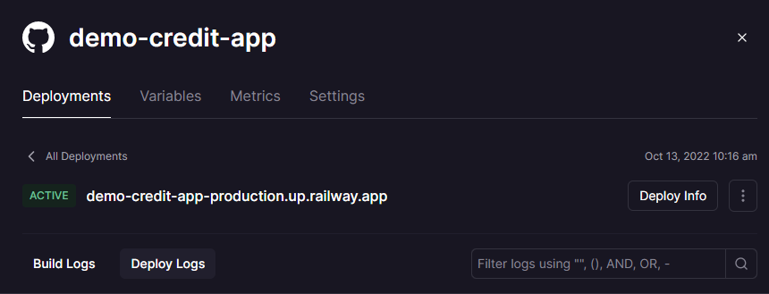

# demo-credit-app

## Overview and Project Summary
In the fintech space today, many of lenders use mobile apps to reach millions of customers. At this scale, we can use NodeJS with TypeScript as its backend software development stack which allows us to rapidly ideate and release features and functionality.

Demo Credit is a mobile lending app that requires wallet functionality. This is needed as borrowers need a wallet to receive the loans they have been granted and also send the money for repayments.

You are required to build an MPV wallet service where:

A user can create an account
A user can fund their account
A user can transfer funds to another user’s account
A user can withdraw funds from their account.

## Objective
- The goal of this project is to provide a secure platform for users to make financial transactions including funding their account, sending and recieving funds.

## Requirements

#### Project Requirements
- [Nodejs](https://nodejs.org/en/) is a JavaScript runtime built on Chrome's V8 JavaScript engine.
- [Mysql](https://dev.mysql.com/downloads) MySQL is a relational database management system based on the Structured Query Language, which is the popular language for accessing and managing the records in the database. It is the most popular Open Source SQL database management system, is developed, distributed, and supported by Oracle Corporation. Many of the world's largest and fastest-growing organizations including Facebook, Twitter, Booking.com, and Verizon rely on MySQL to save time and money powering their high-volume Web sites, business-critical systems and packaged software.
- [Postman](https://www.postman.com/downloads/) is an API client that makes it easy for developers to create, share, test and document APIs. This is done by allowing users to create and save simple and complex HTTP/s requests, as well as read their responses. The result - more efficient and less tedious work.
- [Git](https://git-scm.com/) is a free and open source distributed version control system designed to handle everything from small to very large projects with speed and efficiency.

#### Tech Stack
NodeJS (LTS version)
KnexJS ORM
MySQL database

#### Project Dependencies
- express
- express-rate-limit
- bcrypt
- knex
- jsonwebtoken
- mysql2
- dotenv
- uuid
- helmet
- morgan

#### Project Dev Dependencies
- mocha
- chai 
- chai-http
- nodemon

## Features
- User authentication
- Fund account
- Transfer funds
- Recieve funds
- Check account balance

## User Workflow
- First step involves a user creating creating an account after which a wallet is automatically created for the user
- Upon creation, the user logs into his account
- The user can then fund his account with the desired amount
- The user can then transfer funds to other accounts, withdraw funds or check account balance.

**NB : Endeavour to check the API endpoints section to know the required fields for each of the activity**    

## How to setup locally
- Open your terminal and clone this repository using `git clone https://github.com/emmywhyte93/demo-credit-api.git`.
- Navigate to project folder and install dependencies using `npm install`.
- Create .env file and add environment variables using .env.sample as a guide.
- Run the command `npx knex migrate:latest` to create the tables. 
- Open terminal and type `npm run test` to run tests.
- Type `npm run dev` to run server in development mode.
- Type `npm run start` to start server in production mode. 
- Use postman and navigate to desired endpoints 

## Postman Collection
https://documenter.getpostman.com/view/23777914/2s83zmN36b

## API Endpoints
| HTTP Verbs | Endpoints | Action | Required |
| --- | --- | --- | --- |
| POST | https://demo-credit-app-production.up.railway.app/api/v1/auth/register | Register a new user | req.body.firstName   req.body.password   req.body.email   req.body.lastName   req.body.mobileNumber |
| POST | https://demo-credit-app-production.up.railway.app/api/v1/auth/login | Login user |  req.body.email   req.body.password|
| DELETE | https://demo-credit-app-production.up.railway.app/api/v1/user/delete/:mobileNumber | Delete a user |  req.params.mobileNumber   req.body.email|
| PUT | https://demo-credit-app-production.up.railway.app/api/v1/user/update/:mobileNumber | Update a user |  req.params.mobileNumber   req.body|
| POST | https://demo-credit-app-production.up.railway.app/api/v1/wallet/deposit | Fund wallet  | req.body.email   req.body.amountToFund |
| POST | https://demo-credit-app-production.up.railway.app/api/v1/wallet/transfer | Transfer funds  | req.body.senderEmail   req.body.amountToTransfer   req.body.recieverEmail |
| POST | https://demo-credit-app-production.up.railway.app/api/v1/wallet/withdraw | Withdraw funds  | req.body.email   req.body.amountToWithdraw |
| POST | https://demo-credit-app-production.up.railway.app/api/v1/wallet/balance | Check wallet balance  | req.body.email |

## Database Design

#### Lincense
This project is available for use under the MIT License.

#### Author
[Emmanuel Irabor]((https://github.com/Emmywhyte93))

#### Deployment

The app is deployed on Railway cloud platform

### Link to Deployed app
https://demo-credit-app-production.up.railway.app/

